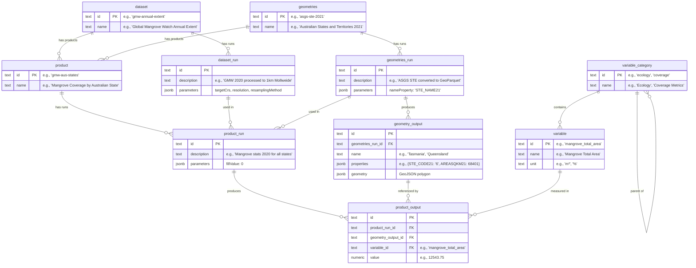

# CSDR Cloud Spatial Data Model

Simplified data model diagram - see [`schema.ts`](../apps/server/src/schemas/index.ts) for the full schema.

## Model Overview

The CSDR data model tracks spatial data processing pipelines from source data through to statistical outputs.

### Core Entities

**`dataset`** - Defines a data source that can be processed

- Example: Global Mangrove Watch Annual Extent

**`geometries`** - Defines a collection of spatial boundaries

- Example: Australian States and Territories 2021

**`product`** - Defines an analysis that combines a dataset with geometries

- Links to exactly one dataset and one geometries collection
- Example: Mangrove Coverage by Australian State

### Runs

"Runs" are used to track the processing of datasets, geometries, and products (basically "versions").

**`dataset_run`** - Records a specific processing of a dataset

- Stores processing parameters (projection, resolution, etc.)
- Example: GMW 2020 processed to 1km Mollweide projection

**`geometries_run`** - Records a specific processing of geometries

- Stores conversion parameters (name property, format, etc.)
- Example: ASGS boundaries converted to GeoParquet

**`product_run`** - Records a specific analysis execution

- References the exact `dataset_run` and `geometries_run` used
- Stores analysis parameters (fill values, statistics to compute, etc.)
- Example: Mangrove statistics calculated for all Australian states

### Outputs

**`geometry_output`** - Individual spatial features from a `geometries_run`

- Each row is one feature (e.g., one state)
- Stores the feature name, properties, and GeoJSON geometry
- Example: Tasmania with its boundary and metadata

**`product_output`** - Statistical results from a `product_run`

- Links a `geometry_output` to a `variable` with a computed value
- Example: Tasmania + mangrove_total_area = 0

### Variable System

**`variable_category`** - Hierarchical organization of variables

- Self-referential parent relationship for nested categories
- Example: Ecology > Coverage

**`variable`** - Defines what can be measured

- Belongs to a category and includes units
- Example: Mangrove Total Area (m²)
